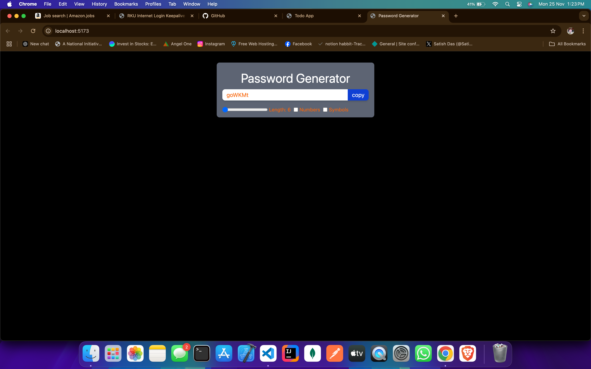
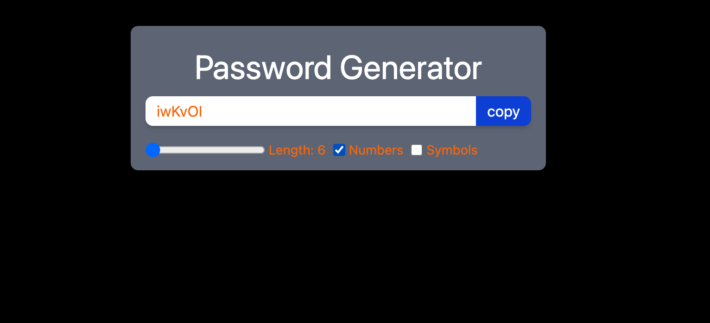
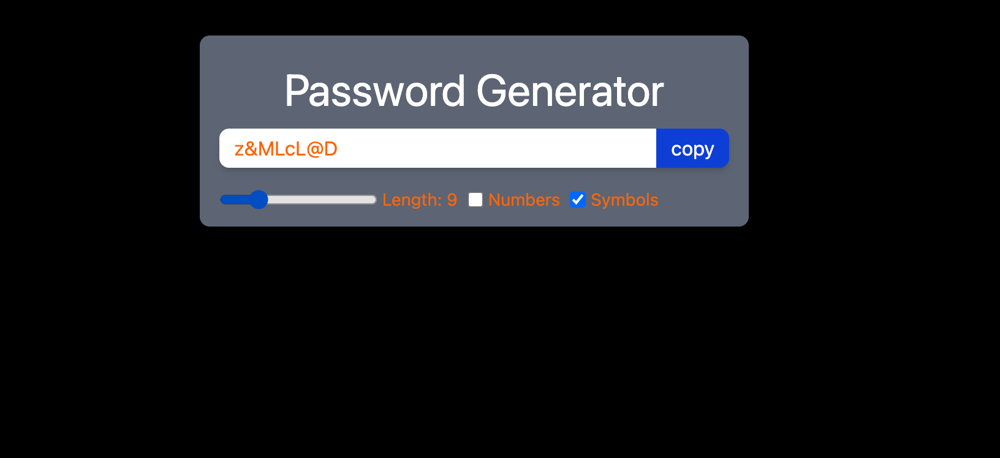
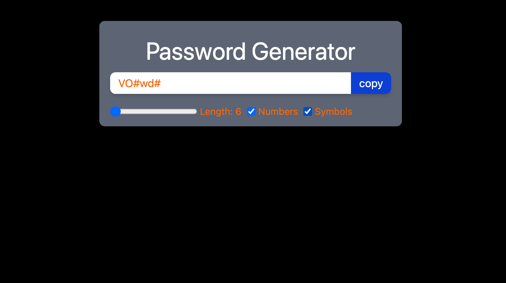

# Password Generator

A simple password generator that allows users to customize the length and complexity of their password.

## Features
- **Adjustable Length**: Modify the password length using a slider.
- **Include Symbols**: Option to include symbols in the password.
- **Include Numbers**: Option to include numbers in the password.
- **Copy to Clipboard**: Easily copy the generated password with a single click.

## How It Works
1. Move the slider to set the desired password length.
2. Check or uncheck the boxes to include symbols or numbers.
3. Click the **Copy** button to save the generated password to your clipboard.

## Usage
This tool is perfect for creating secure and unique passwords for your accounts or projects.

---
*Developed for enhanced password security and user customization.*

## Screenshot

